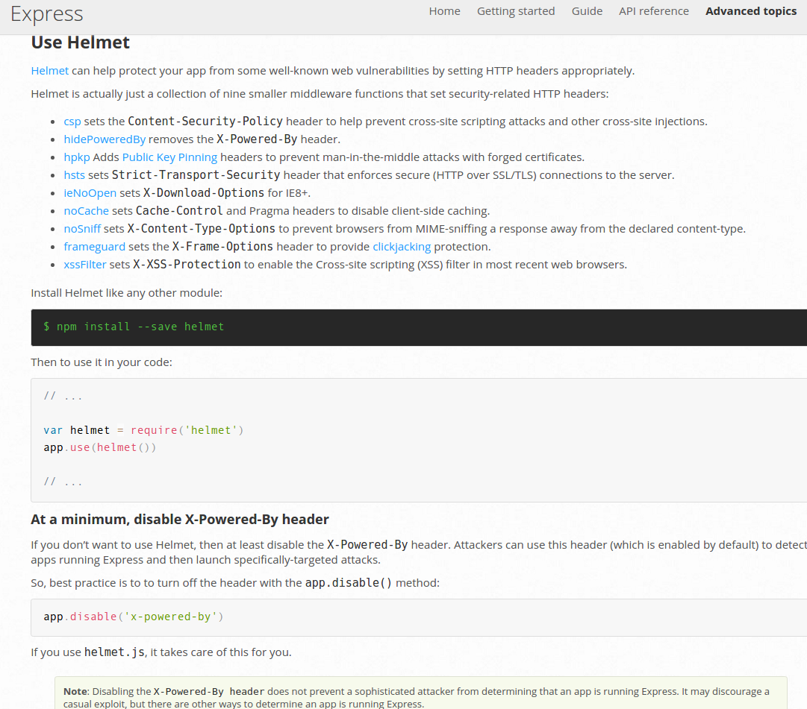

# Helmet security Express routes
I followed the best practice giuide on the website of Expressjs.com: https://expressjs.com/en/advanced/best-practice-security.html
They recommend to use Helmet to protect your app from some well-known web vulnerabilities by setting HTTP headers appropriately. 
Helmet is actually a collection of nine smaller middleware functions that set security-related HTTP headers.

